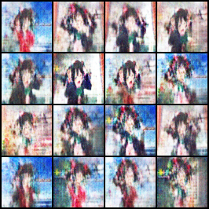

# PatchGAN
Generative adversarial network which uses patches to discriminate against generator. Technique used in image-to-image translation remade for image generation!

Install Python 3.8 and Pytorch 2.4.1

Use is possible on a small dataset (100 images could be enough if the images are similar).

